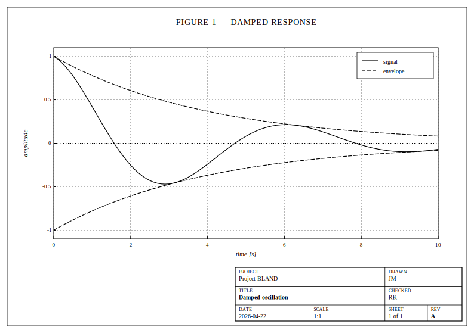

# BLAND — Elixir Technical Drawing

> Pure-Elixir library for paper-ready, monochrome, hatch-patterned
> technical plots in the visual tradition of 1960s–80s engineering
> reports.



BLAND emits SVG. Plots look at home next to a title block, a set of
fastener callouts, and a stack of punched cards — black ink on white
paper, serif type, thin rules, hatched fills. No color, no gradients, no
drop shadows.

See the [gallery](pages/gallery.md) for every plot type at a glance.

```elixir
xs = Enum.map(0..100, &(&1 / 10.0))

fig =
  Bland.figure(size: :a5_landscape, title: "Damped oscillation")
  |> Bland.axes(xlabel: "t [s]", ylabel: "x(t)")
  |> Bland.line(xs, Enum.map(xs, &(:math.exp(-&1/4) * :math.cos(&1))), label: "response")
  |> Bland.line(xs, Enum.map(xs, &(:math.exp(-&1/4))), label: "envelope", stroke: :dashed)
  |> Bland.hline(0.0, stroke: :dotted)
  |> Bland.legend(position: :top_right)
  |> Bland.title_block(
    project: "BLAND Reference",
    title:   "Fig. 1 · Damped oscillation",
    drawn_by: "JM",
    date:    "2026-04-21",
    scale:   "1:1",
    sheet:   "1 of 1",
    rev:     "A"
  )

Bland.write!(fig, "oscillation.svg")
```

## Why monochrome?

  * **Prints clean.** Plots look the same on a laser printer, a color
    printer, and a photocopy. No "figure is unreadable in the proceedings"
    surprises.
  * **Accessible by default.** Hatching, stroke dashing, and marker shape
    distinguish series — so plots survive grayscale rendering and are
    legible to readers with color vision deficiency.

## Features

  * Series: line, scatter, bar (grouped), area, reference rules
  * Hatch patterns: 13 presets plus a `define/3` helper for custom fills
  * Markers: 12 shape presets (open / filled / open-cross variants)
  * Stroke dashes: solid, dashed, dotted, dash-dot, long-dash, fine
  * Paper presets: A4, A5, Letter, Legal, Square — portrait & landscape
  * Themes: `:report_1972` (serif), `:blueprint` (mono), `:gazette` (news)
  * Engineering title block with project / drawn-by / date / scale /
    sheet / revision
  * Annotations: in-data text and arrows
  * Linear and log axes with nice-rounded tick placement
  * Pure-Elixir output — no Python, no Node, no canvas libraries

## Installation

The package is published on Hex as `bland` and can be added to your project as follows:

```elixir
def deps do
  [
    {:bland, "~> 0.2.1"}
  ]
end
```

BLAND has no runtime dependencies on its own but requires `kino` when used in a Livebook.

## Using it from Livebook

```elixir
Mix.install([
  {:bland, "~> 0.2.1"},
  {:kino, "~> 0.14"}
])

Bland.figure() |> Bland.line([1, 2, 3], [1, 4, 9]) |> Bland.to_kino()
```

See [`notebooks/showcase.livemd`](notebooks/showcase.livemd) for a full
walk-through.

## Documentation

  * [Getting started](pages/getting_started.md)
  * [Patterns and hatching](pages/patterns_and_hatching.md)
  * [Styling and themes](pages/styling_and_themes.md)
  * [Paper output](pages/paper_output.md)

Full API docs: run `mix docs` and open `doc/index.html`.

## License

MIT.
