# Gallery

Every plot type BLAND ships, at a glance. Each image is rendered by
`mix bland.docs.examples` from the code in
[`lib/mix/tasks/bland.docs.examples.ex`](https://github.com/Stratogen-Applied-Research/bland/blob/main/lib/mix/tasks/bland.docs.examples.ex).

## Lines, areas, reference rules


```elixir
Bland.figure(title: "Damped oscillation")
|> Bland.axes(xlabel: "t [s]", ylabel: "x(t)")
|> Bland.line(xs, signal, label: "signal")
|> Bland.line(xs, envelope, label: "envelope", stroke: :dashed)
|> Bland.hline(0.0, stroke: :dotted)
|> Bland.legend(position: :top_right)
```

## Scatter + hatched area

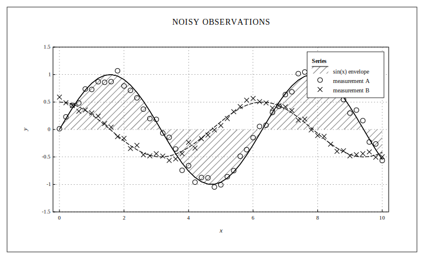

## Bars — grouped with hatch variety

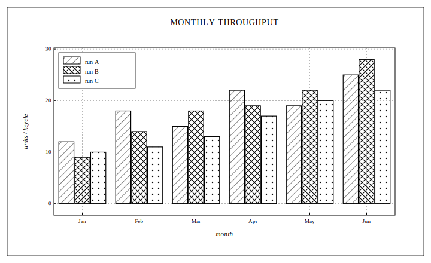

## Histograms — counts, PMF, density, CMF

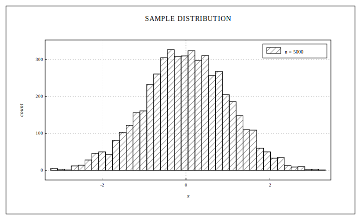

`Bland.histogram/3` accepts `normalize: :count | :pmf | :density | :cmf`.
The `:cmf` path renders as a staircase step line for empirical CDFs.

## Box plots — statistical summary

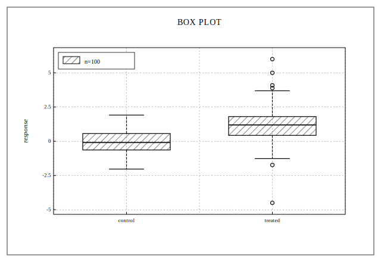

## Error bars

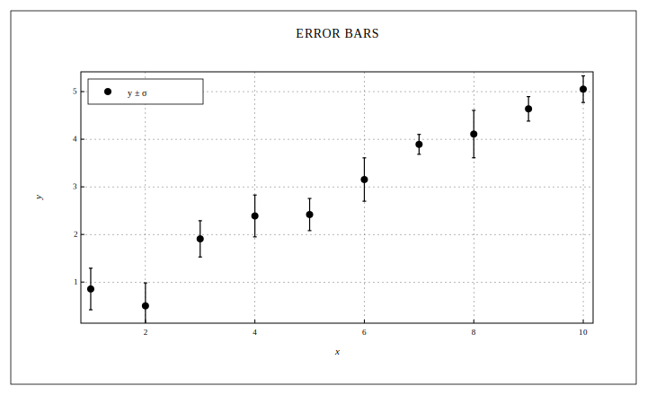

Symmetric half-widths or asymmetric `{lo, hi}` tuples; `yerr`, `xerr`,
or both.

## Stem plots — discrete-time signals

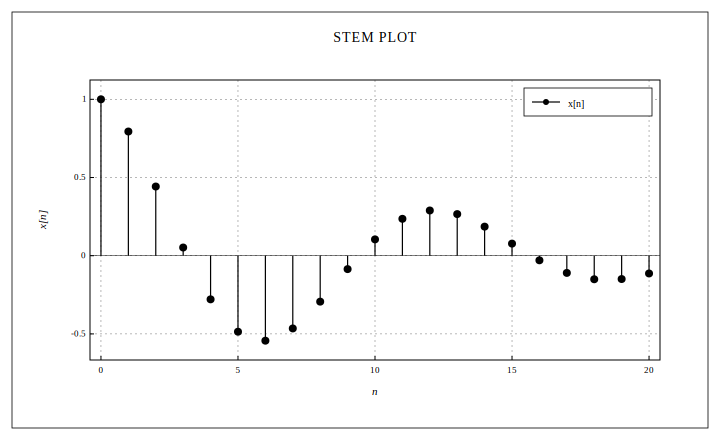

## Heatmap with colorbar

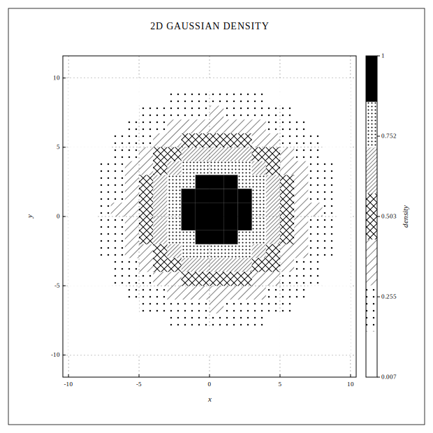

Cells are quantized to a hatch ramp. The default 7-level ramp runs
`white → dots → diagonal → crosshatch → diagonal_dense → dots_dense →
solid_black`. Colorbar auto-reads the last heatmap.

## Contour plots

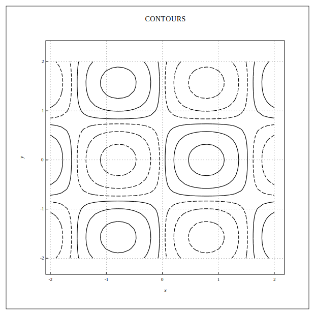

Marching squares at user-chosen levels. Negative levels auto-dash for
sign-readability in grayscale.

## Vector fields (quiver)

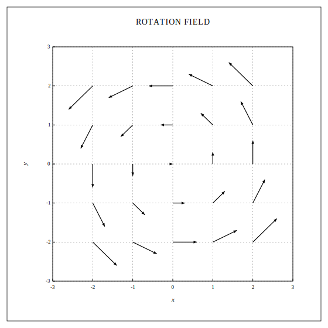

## Q-Q plots

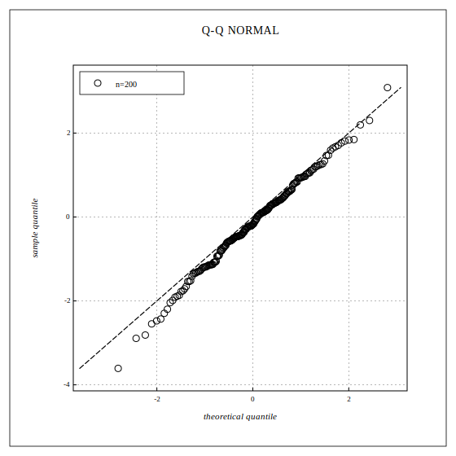

Sample quantiles vs theoretical normal quantiles with a y=x reference.

## Polar plots

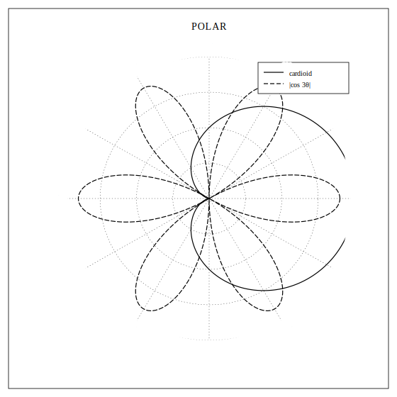

`Bland.polar_figure/1` + `Bland.polar_grid/2`. Pass `{θ, r}` pairs;
BLAND projects and clips to the unit disk.

## Smith charts

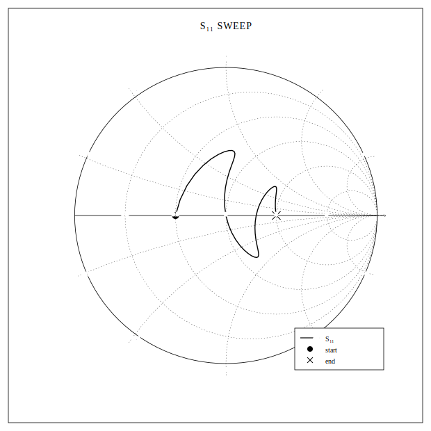

`Bland.smith_figure/1` + `Bland.smith_grid/2`. Plot reflection
coefficients directly, or convert from impedance via
`Bland.Smith.gamma_from_z/1`.

## Geographic maps

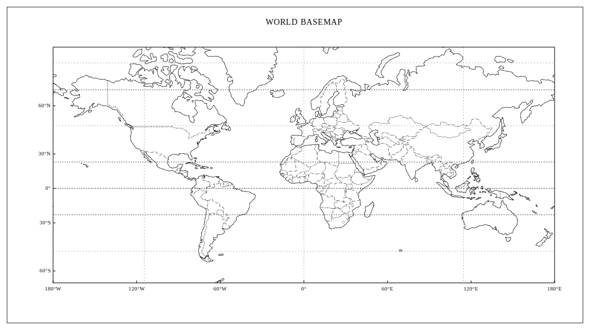

Natural Earth 1:110m coastlines + countries, vendored. Also 1:50m
(`resolution: :high`) for regional detail.

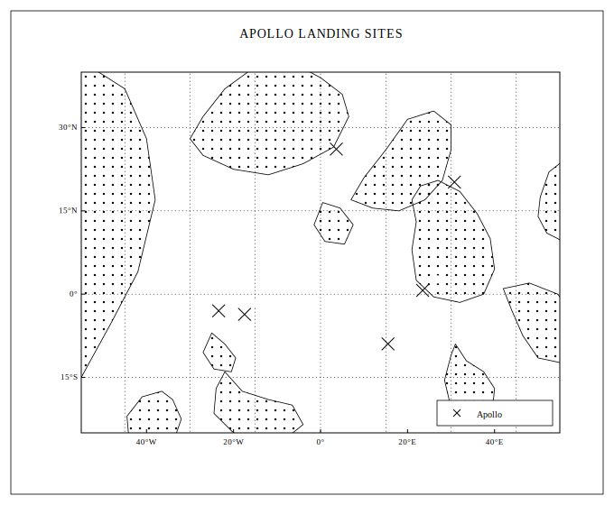

## Bode plots (two-panel frequency response)

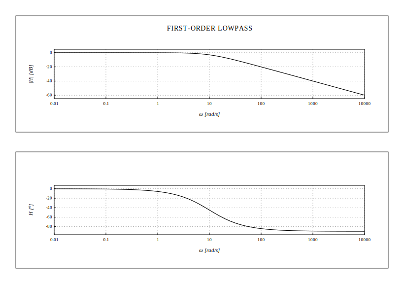

`Bland.bode/4` — magnitude (dB, log ω) on top, phase (°, log ω) below.
Built on subplots.

## Subplots — multi-panel figures

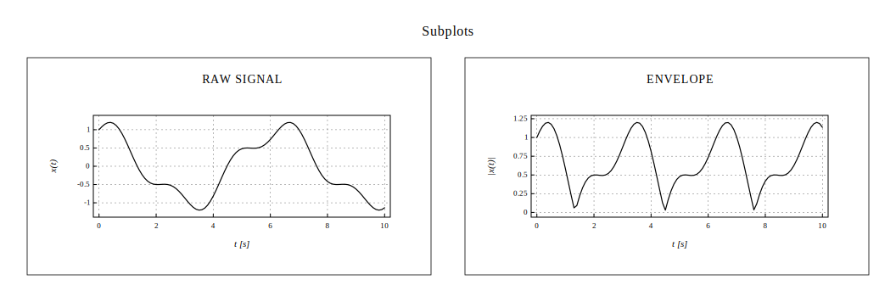

`Bland.grid/2` composes any list of figures into one printable SVG.

## Full engineering drawing — with title block


Attach a drafting title block via `Bland.title_block/2`. The bottom
margin auto-expands to accommodate it.
