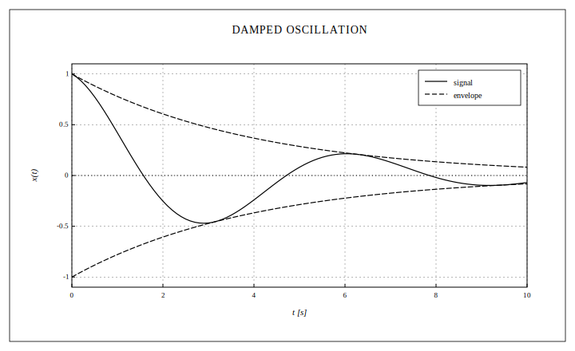

# Getting Started



This guide walks through the BLAND pipeline end-to-end. By the end you
should be able to build a figure, cycle through the supported series
types, render it, and embed it in Livebook or drop it into a paper.

See the [gallery](gallery.md) for every plot type at a glance.

## Installation

Add BLAND to your `mix.exs`. The package is published on Hex as
`bland`; modules are namespaced under `Bland`.

```elixir
def deps do
  [
    {:bland, "~> 0.1.0"}
  ]
end
```

Then `mix deps.get`.

## The pipeline

BLAND is built around an immutable `%Bland.Figure{}` struct. Every builder
function returns an updated figure, so you pipe top-to-bottom just like
`Plug.Conn` or `Ecto.Changeset`:

```elixir
Bland.figure()            # build a canvas
|> Bland.axes(xlabel: "x")# configure axes, limits, scale
|> Bland.line(xs, ys)     # add one or more series
|> Bland.legend()         # optional: ornaments
|> Bland.to_svg()         # render to an SVG string
```

`to_svg/1` always returns a binary. `write!/2` writes that binary to a
path; `to_kino/1` wraps it in a `Kino.Image` for Livebook inline display.

## Your first figure

```elixir
xs = Enum.map(0..100, &(&1 / 10.0))
ys = Enum.map(xs, &:math.sin/1)

fig =
  Bland.figure(size: :a5_landscape, title: "sin(x)")
  |> Bland.axes(xlabel: "x [rad]", ylabel: "sin(x)")
  |> Bland.line(xs, ys, label: "y = sin(x)")
  |> Bland.legend(position: :top_right)

Bland.write!(fig, "hello_sin.svg")
```

Open `hello_sin.svg` in any browser. You'll get a framed plot with
serif axis labels, a legend in the top-right, and a dashed grid.

## Series types

Every series is a plain struct tagged with a `:type` field. The builders
in `Bland` wrap them:

| Builder                 | Struct                | What it draws                                  |
| ----------------------- | --------------------- | ---------------------------------------------- |
| `Bland.line/4`            | `Bland.Series.Line`     | Connected polyline                              |
| `Bland.scatter/4`         | `Bland.Series.Scatter`  | Discrete markers at `(x,y)`                    |
| `Bland.bar/4`             | `Bland.Series.Bar`      | Categorical bars (grouped via `:group`)        |
| `Bland.histogram/3`       | `Bland.Series.Histogram`| Binned observations on a numeric x-axis        |
| `Bland.heatmap/3`         | `Bland.Series.Heatmap`  | 2D grid rendered with a hatch ramp             |
| `Bland.area/4`            | `Bland.Series.Area`     | Filled region between a curve and a baseline   |
| `Bland.hline/3`/`vline/3` | `Bland.Series.Hline/Vline` | Horizontal / vertical reference rules       |

You can mix line / scatter / area freely on one figure. Bar series
switch the x-axis into categorical mode — combining bars with numeric
series on the same figure is unsupported.

### Line

```elixir
Bland.line(fig, xs, ys,
  label: "signal",
  stroke: :dashed,       # :solid (default) | :dashed | :dotted | :dash_dot | :long_dash | :fine
  stroke_width: 1.5,
  markers: true,         # optional: draw a marker at every point
  marker: :circle_open,
  marker_size: 4
)
```

### Scatter

```elixir
Bland.scatter(fig, xs, ys,
  label: "observations",
  marker: :cross,
  marker_size: 5
)
```

### Bar

```elixir
fig
|> Bland.bar(["A", "B", "C"], [1, 4, 2],
     label: "run 1", hatch: :diagonal, group: :r1)
|> Bland.bar(["A", "B", "C"], [2, 3, 5],
     label: "run 2", hatch: :crosshatch, group: :r2)
```

Multiple bar series on the figure with distinct `:group` values produce
a side-by-side grouped bar chart. Omit `:group` (all series default to
`:default`) and they'll all land in the same slot, which is usually not
what you want.

### Histogram

```elixir
# Sturges' rule (default)
Bland.histogram(fig, samples, label: "observations")

# Integer bin count + explicit hatch
Bland.histogram(fig, samples, bins: 20, hatch: :diagonal, label: "trial 1")

# Density normalization + Scott's rule — for comparing distributions
# of different sample sizes
Bland.histogram(fig, samples, bins: :scott, normalize: :density, hatch: :crosshatch)

# Probability mass function — bars summing to 1
Bland.histogram(fig, samples, bins: 30, normalize: :pmf, hatch: :diagonal)

# Empirical CDF — renders as a staircase step line (not bars)
Bland.histogram(fig, samples, bins: 50, normalize: :cmf, label: "F(x)")

# Explicit edges — useful when you want two histograms to share the
# same binning for comparison
Bland.histogram(fig, a, bin_edges: edges, label: "A", hatch: :diagonal)
|> Bland.histogram(b, bin_edges: edges, label: "B", hatch: :dots_sparse)
```

Strategies accepted by `:bins`: an integer for exactly that many equal-
width bins, `:sturges` (default), `:sqrt`, `:scott`, or
`:freedman_diaconis`. See `Bland.Histogram` for the underlying helpers.

### Heatmap

```elixir
# 20 × 20 grid of a 2D Gaussian
grid =
  for j <- -10..9, into: [] do
    for i <- -10..9, into: [] do
      :math.exp(-(i * i + j * j) / 40)
    end
  end

Bland.figure(size: :square)
|> Bland.axes(xlabel: "x", ylabel: "y")
|> Bland.heatmap(grid,
     x_edges: Enum.map(-10..10, &(&1 * 1.0)),
     y_edges: Enum.map(-10..10, &(&1 * 1.0)),
     label: "density")
|> Bland.colorbar()
```

Cells are quantized to `length(ramp)` levels (default 7). Pass
`ramp: Bland.Heatmap.ramp(4)` for a coarser banding, or any list of
pattern preset atoms for a custom ramp. See `Bland.Heatmap`.

### Geographic maps (Mercator)

Enable a projection on `figure/1` and drop in a vendored Natural Earth
basemap:

```elixir
Bland.figure(projection: :mercator, xlim: {-180, 180}, ylim: {-70, 75})
|> Bland.basemap(:earth_coastlines)                    # 1:110m default
|> Bland.basemap(:earth_borders, stroke: :dashed)
|> Bland.basemap(:earth_tropics, stroke: :dotted)
|> Bland.scatter(city_lons, city_lats, marker: :circle_filled)
```

Resolutions available via `resolution:`:

  * `:low`       — Natural Earth 1:110m (default, ~180 KB compiled)
  * `:high`      — Natural Earth 1:50m (~2.8 MB compiled, detailed)
  * `:schematic` — BLAND's hand-drawn outlines (0.1)

Lunar maria render the same way (`:moon_maria` layer, hand-curated).

All series interpret their x values as longitude (degrees) and y values
as latitude (degrees). The renderer projects each point through the
named transform before scaling. `Bland.graticule/2` adds a lat/lon grid
overlay; `Bland.Geo` exposes the math directly. See
`Bland.Geo`.

### Area

```elixir
Bland.area(fig, xs, ys, label: "band", hatch: :dots_sparse, baseline: 0.0)
```

### Reference rules

```elixir
fig
|> Bland.hline(0.0, stroke: :dotted)
|> Bland.vline(2.7, stroke: :dashed, label: "cutoff")
```

## Axes

`Bland.axes/2` merges its keyword options into the figure. You can call it
multiple times; later calls override earlier ones.

```elixir
Bland.axes(fig,
  xlabel: "t [s]",       ylabel: "amplitude",
  xlim: {0, 10},         ylim: :auto,
  xscale: :linear,       yscale: :linear,   # or :log
  grid: :major           # :none | :major | :both
)
```

Limits default to `:auto`, which derives the domain from the data with
a small padding. Tick positions are picked via `Bland.Ticks.nice/2` so
axes break on human-friendly numbers.

## Legend

```elixir
Bland.legend(fig, position: :top_right, title: "Experiment")
```

Legend entries are generated automatically from series `:label` values.
Series without a label are silently skipped. Positions are
`:top_right | :top_left | :bottom_right | :bottom_left | {x, y}`.

## Title block

```elixir
Bland.title_block(fig,
  project:     "Project BLAND",
  title:       "Drag coefficient",
  drawn_by:    "J. Doe",
  checked_by:  "R. Koss",
  date:        "1974-03-21",
  scale:       "1:1",
  sheet:       "3 of 9",
  rev:         "B"
)
```

BLAND auto-expands the bottom margin when a title block is attached so
the block sits below the plot frame rather than overlapping it.

## Annotations

```elixir
fig
|> Bland.annotate(text: "peak at t=3.7s", at: {3.7, 0.92})
|> Bland.annotate(arrow: {{3.5, 0.85}, {3.7, 0.92}})
```

Coordinates are in data space. The renderer projects them through the
same scale your series uses.

## Output

```elixir
svg = Bland.to_svg(fig)          # binary
:ok = Bland.write!(fig, "a.svg") # writes to disk
Bland.to_kino(fig)               # in a Livebook cell
```

For PDF, PNG, or EPS output, convert the SVG with `rsvg-convert`,
Inkscape, or headless Chromium. See the [Paper output](paper_output.md)
guide.

## Next

  * [Patterns and hatching](patterns_and_hatching.md) — the full
    preset gallery and how to build your own fills.
  * [Styling and themes](styling_and_themes.md) — tweaking fonts,
    stroke weights, and the built-in themes.
  * [Paper output](paper_output.md) — sizes, DPI, printing.
